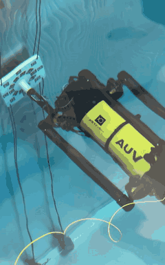
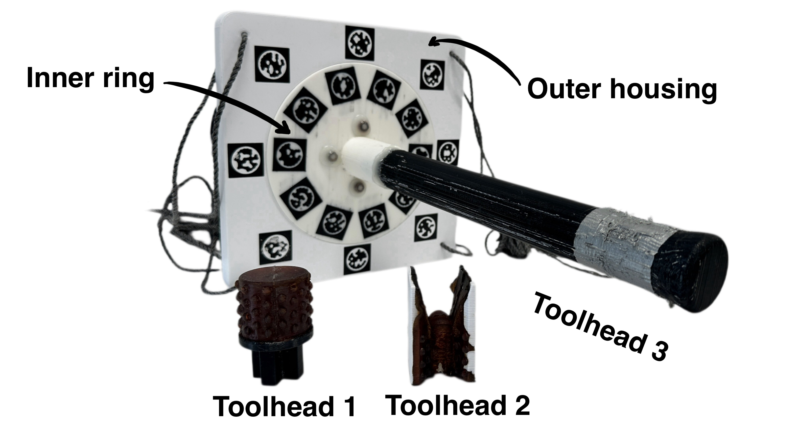

<h1 align="center">AUV Gym</h1>


<table>
<tr>
<td width="30%" valign="top">

<a href="auv_gym/image/IMG_0560.MOV">
  
</a>
<p><small><a href="auv_gym/image/IMG_0560.MOV">Open the full-resolution pool video</a></small></p>

</td>
<td width="70%" valign="top">

AUV Gym is the software component of an open-source, robot-agnostic underwater manipulation testbed. It connects visual marker detection, vehicle control, task-specific rewards, and the <a href="https://github.com/UoA-CARES/cares_reinforcement_learning">CARES reinforcement-learning library</a>.

The current implementation is validated with a Boxfish AUV. Boxfish is one vehicle implementation, not a requirement of the testbed design: compatible vehicles can be connected through the <a href="auv_gym/robot_adapter.py">RobotAdapter</a> interface.

> **Hardware warning:** this repository is intended for experiments with a physical vehicle and camera. Resetting or stepping an environment can access the camera and issue movement commands. Test with the vehicle secured, confirm action limits, and keep an operator able to stop the vehicle.

[](#requirements)
[](LICENSE)
[](LICENSE-HARDWARE)

</td>
</tr>
</table>

The looping GIF preview is used here because GitHub does not reliably render repository-local `<video>` tags in README pages. Click the preview to open the full `.MOV` video.


## Contents

- [Requirements](#requirements)
- [Getting started](#getting-started)
- [Quick start](#quick-start)
- [Usage](#usage)
- [Hardware setup](#hardware-setup)
- [Robot adapters](#robot-adapters)
- [Training with CARES RL](#training-with-cares-rl)
- [Tasks and observations](#tasks-and-observations)
- [Repository layout](#repository-layout)
- [Accompanying paper](#accompanying-paper)
- [Development](#development)
- [License and project status](#license-and-project-status)

## Requirements

The current hardware implementation requires:


- A different vehicle needs its own control/SDK package and a compatible adapter.
- A checkout of [CARES reinforcement learning](https://github.com/UoA-CARES/cares_reinforcement_learning).
- A compatible camera, calibration files, fiducial-marker setup, and vehicle-control configuration.

## Getting started

Clone the repositories beside one another, create a virtual environment, and install the local packages in editable mode:

```bash
git clone https://github.com/UoA-CARES/auv_gym.git
git clone https://github.com/UoA-CARES/boxfish.git
git clone https://github.com/UoA-CARES/cares_reinforcement_learning.git

cd auv_gym
python -m venv .venv
source .venv/bin/activate
python -m pip install --upgrade pip

python -m pip install -r ../cares_reinforcement_learning/requirements.txt
python -m pip install -e ../boxfish/boxfish_lib
python -m pip install -e ../cares_reinforcement_learning
python -m pip install -e .
```

The relative paths assume this layout:

```text
parent-directory/
├── auv_gym/
├── boxfish/
└── cares_reinforcement_learning/
```

Before running a physical experiment, verify the installed CARES RL revision, camera calibration, marker IDs, vehicle action limits, and stop behavior.

## Quick start

Create an environment through the factory and run the custom environment loop:

```bash
python3 run.py train config --data_path /home/anyone/main/configs
```

This is an online hardware example, not a simulator smoke test. Depending on the task, marker loss can pause for operator input or truncate an episode.

## Usage

### Environment API

AUV Gym uses a small custom API:

- `reset()` returns the initial state.
- `step(action)` returns `state, reward, done, truncated, environment_info`.
- `sample_action()` samples an action using the configured action bounds.
- `normalize()` and `denormalize()` convert between vehicle action ranges and `[-1, 1]`.

The environment factory currently supports the `boxfish` domain and the task names listed below:

| Task | Implementation | Purpose |
| --- | --- | --- |
| `stationary` | `StationaryCubeTask` | Move a marked cube relative to the gripper markers. |
| `rotation` | `RotationTask` | Abstract base for rotation tasks. |
| `OneMarkerSpin` | `OneMarkerSpin` | Spin toward a selected inner-wheel marker target. |
| `FiveMarkerSpin` | `FiveMarkerSpin` | Spin using a randomly selected inner-wheel marker target. |

`RotationTask` is abstract in the current source, so use `OneMarkerSpin` or `FiveMarkerSpin` for a concrete rotation environment.

### Configuration

When default configuration loading is used, `EnvironmentFactory` expects:

```text
~/main/configs/auv_env_config.json
~/main/configs/auv_config.json
```

`auv_env_config.json` contains camera, calibration, marker-size, display, tolerance, and episode settings. `auv_config.json` contains the vehicle control method, device name, action names, action bounds, home sequence, and gripper-marker IDs.

Example shape for `auv_env_config.json`:

```json
{
  "camera_id": 0,
  "camera_matrix": "/path/to/camera_matrix.txt",
  "camera_distortion": "/path/to/camera_distortion.txt",
  "episode_horizon": 20,
  "noise_tolerance": 15,
  "display": true
}
```

Example shape for `auv_config.json`:

```json
{
  "device_name": "boxfish",
  "control_method": "onboard",
  "baudrate": 115200,
  "control_actions": ["roll"],
  "min_values": [-90],
  "max_values": [90],
  "gripper_marker_ids": [7, 8]
}
```

These snippets are illustrative. Use values calibrated for the vehicle, camera, marker layout, and selected task.

## Hardware setup

The physical fixture uses a marked outer housing, an  inner ring, and removable toolheads for different manipulation tasks.



The fabrication files are in [`auv_gym/hardware`](auv_gym/hardware):

- [`inner_ring.3mf`](auv_gym/hardware/inner_ring.3mf) is the inner ring.
- [`Outter_housing.3mf`](auv_gym/hardware/Outter_housing.3mf) is the outer housing. The 3MF files support multi-colour printing or separate prints.
- [`toolhead1/`](auv_gym/hardware/toolhead1) contains the Toolhead 1 base and its two-piece left/right mold.
- [`toolhead2/`](auv_gym/hardware/toolhead2) contains the Toolhead 2 base and its two-piece left/right mold.
- [`toolhead3.stl`](auv_gym/hardware/toolhead3.stl) is the standalone Toolhead 3 mesh.

The Toolhead 1 and Toolhead 2 mold designs were used with [Smooth-On PMC-770](https://www.smooth-on.com/products/pmc-770/). Select the printing or casting workflow appropriate for the material and fabrication equipment available for your build.

## Robot adapters

The environments depend on a small control contract rather than directly on the Boxfish controller. [`robot_adapter.py`](auv_gym/robot_adapter.py) provides that contract through `RobotAdapter` and includes `BoxfishAdapter`, which is used for the existing Boxfish configuration.

To connect another robot, create a class that inherits from `RobotAdapter` and store the robot's native controller or SDK client inside it. The adapter translates AUV Gym actions into the units and commands required by the robot.

An adapter should:

1. Define `control_actions`, `min_values`, and `max_values` with matching lengths, then set the marker IDs and action type required by the task.
2. Implement `info()`, `safety_check()`, `home()`, `move(actions)`, and `stop()`.
3. Add task-specific motion methods such as `move_roll_grabber()` or `spin_by_angle()` when the selected task requires them.
4. Return the observation fields expected by the task, including the IMU and marker-pose data used by its state conversion.
5. Release connections and leave the robot stopped in `close()`.

Pass a custom adapter as `robot=...` when creating the environment. The adapter changes vehicle control; it does not replace the camera, marker detector, calibration files, or task-specific observation pipeline.


## Tasks and observations

- Observations are NumPy arrays assembled from IMU and detected-marker pose information. Their size and meaning depend on the selected task.
- `environments/reward_config.py` contains the active rotation/yaw reward implementation, including angular-distance progress, distance-to-goal shaping, and goal bonuses.
- The paper's reported experiments use the single-marker and five-marker rotation tasks. Other task code should be treated as additional or experimental functionality unless separately validated.

## Repository layout

```text
auv_gym/
├── auv_gym/
│   ├── environments/
│   │   ├── environment.py
│   │   ├── environment_factory.py
│   │   ├── rotation.py
│   │   ├── stationary.py
│   │   └── reward_config.py
│   ├── hardware/
│   │   ├── inner_ring.3mf
│   │   ├── Outter_housing.3mf
│   │   ├── toolhead1/
│   │   ├── toolhead2/
│   │   └── toolhead3.stl
│   ├── image/
│   │   ├── fixture_and_toolheads.jpeg
│   │   ├── IMG_0560.MOV
│   │   └── IMG_0560_preview.gif
│   ├── tools/
│   ├── robot_adapter.py
│   ├── auv_trainer.py
│   └── run.py
├── LICENSE
├── LICENSE-HARDWARE
├── paper.tex
└── setup.py
```


## License and project status

Research use of this testbed is welcomed by the project maintainers.

- The Python software in this repository is licensed under the [MIT License](LICENSE).
- The CAD and hardware source files in [`auv_gym/hardware`](auv_gym/hardware) are licensed under [CERN-OHL-P-2.0](LICENSE-HARDWARE).
- The photographs, pool video, and other media are not automatically covered by either license. Their reuse should be cleared separately with the rights holders.
- CARES RL, camera software, and other third-party dependencies remain under their own licenses.

The copyright notices use the authors listed in the accompanying paper. Confirm authorship, institutional approval, and any third-party rights before publishing or redistributing the repository.
